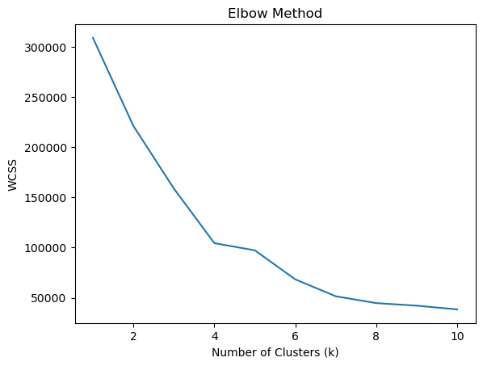
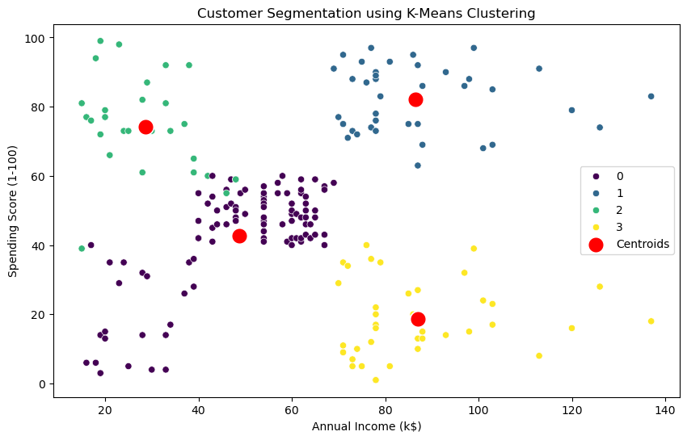

# Customer Segmentation using K-Means Clustering

This project demonstrates customer segmentation using the K-Means clustering algorithm. The workflow includes data preprocessing, exploratory data analysis, clustering, and visualization.

---

## 📊 Workflow Overview

1. **Import Dependencies**
2. **Load and Preprocess Data**
3. **Exploratory Data Analysis**
4. **Feature Encoding**
5. **Train-Test Split**
6. **Finding Optimal Clusters (Elbow Method)**
7. **K-Means Clustering**
8. **Cluster Visualization**
9. **Results & Insights**

---

## 1. Import Dependencies

```python
import os
import pandas as pd
import numpy as np
from sklearn.model_selection import train_test_split
from sklearn.preprocessing import LabelEncoder, StandardScaler
from sklearn.cluster import KMeans
import seaborn as sns
import matplotlib.pyplot as plt
```

---

## 2. Load and Preprocess Data

```python
df = pd.read_csv('../Datasets/customers.csv')
df.drop(columns=['CustomerID'], inplace=True)
```

---

## 3. Exploratory Data Analysis

```python
df.info()
df.describe()
df.isnull().sum()
sns.heatmap(df.corr(), annot=True, cmap='coolwarm')
sns.pairplot(df)
```

---

## 4. Feature Encoding

```python
# For binary gender, LabelEncoder is sufficient
df['Gender'] = LabelEncoder().fit_transform(df['Gender'])
```

---

## 5. Train-Test Split

```python
X = df.iloc[:, 0:]  # Use all features for clustering
X_train, X_test = train_test_split(X, test_size=0.2, random_state=42)
```

---

## 6. Finding Optimal Clusters (Elbow Method)

```python
wcss = []
for k in range(1, 11):
    kmeans = KMeans(n_clusters=k, init='k-means++', random_state=42)
    kmeans.fit(X.values)
    wcss.append(kmeans.inertia_)

plt.plot(range(1, 11), wcss)
plt.xlabel('Number of Clusters (k)')
plt.ylabel('WCSS')
plt.title('Elbow Method')
plt.show()
```


---

## 7. K-Means Clustering

```python
kmeans = KMeans(n_clusters=4, init='k-means++', random_state=42)
kmeans.fit(X.values)
y = kmeans.predict(X.values)
df["Cluster"] = y
```

---

## 8. Cluster Visualization

```python
plt.figure(figsize=(10, 6))
sns.scatterplot(x='Annual Income (k$)', y='Spending Score (1-100)', hue='Cluster', data=df, palette='viridis')
sns.scatterplot(x=kmeans.cluster_centers_[:, 2], y=kmeans.cluster_centers_[:, 3], color='red', s=200, label='Centroids')
plt.title('Customer Segmentation using K-Means Clustering')
plt.show()
```


---

## 9. Results & Insights

- Customers are segmented into distinct groups based on their annual income and spending score.
- The Elbow Method helps determine the optimal number of clusters.
- Visualizations provide clear insights into customer segments for targeted marketing strategies.

---

## 📁 Project Structure

```
CustomerSegemtnationKmean/
│
├── Notebooks/
│   └── index.ipynb
├── images/
│   ├── workflow.png
│   ├── wcss1.png
│   └── wcss2.png
├── Datasets/
│   └── customers.csv
└── README.md
```

---

Feel free to explore the notebook for detailed code and