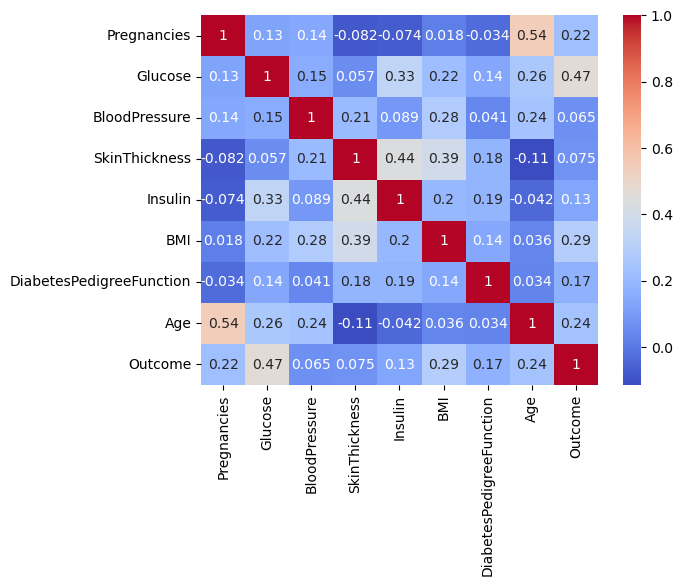
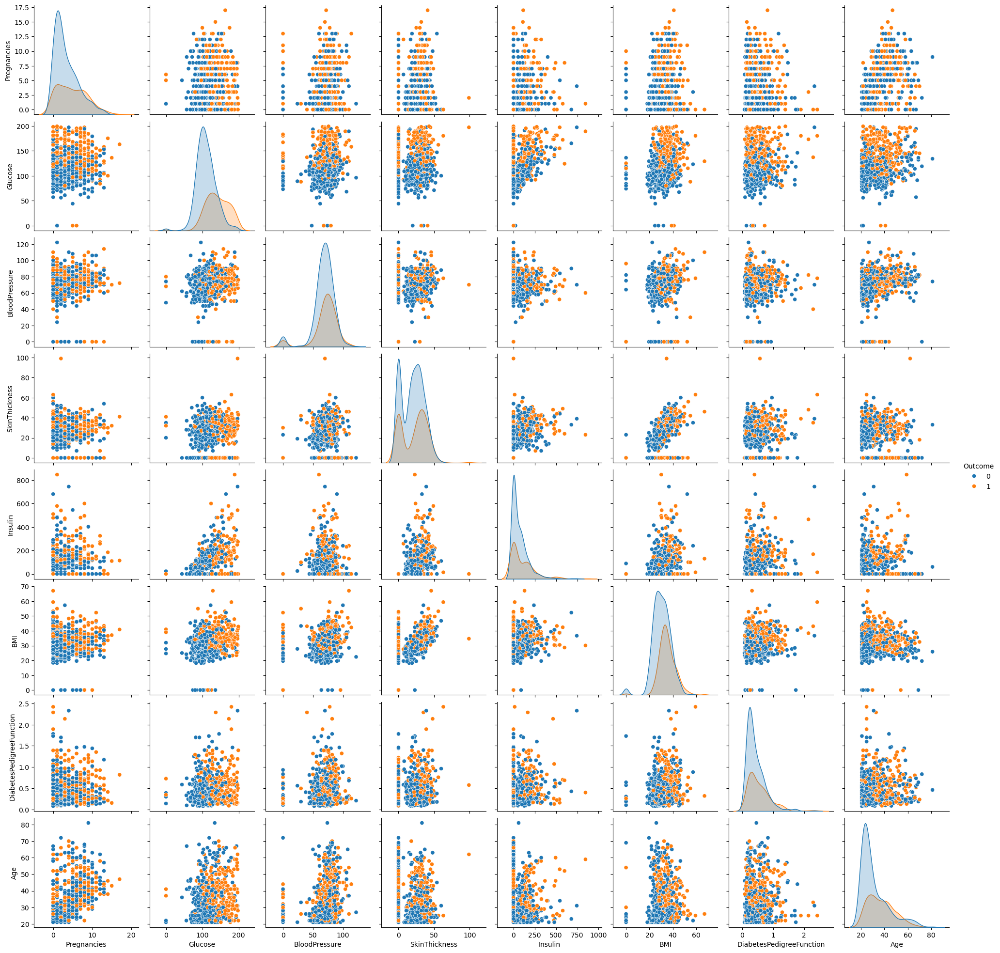
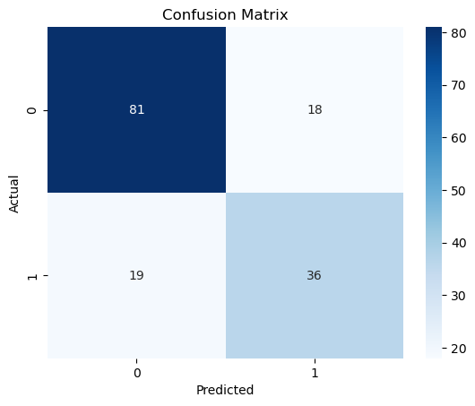
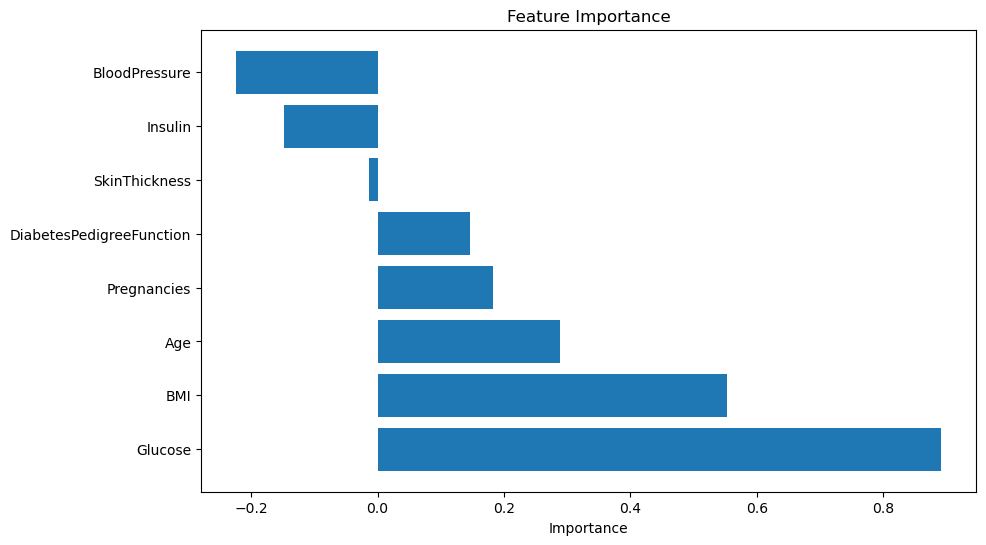
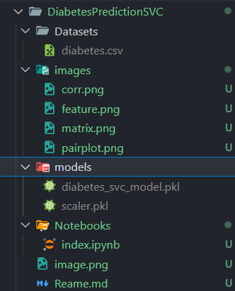

# Diabetes Prediction Project

This project demonstrates how to build and evaluate machine learning models for predicting diabetes using the Pima Indians Diabetes Dataset.

---

## 📊 Workflow Overview

1. **Data Import & Analysis**
2. **Data Preprocessing**
3. **Train-Test Split**
4. **Feature Scaling**
5. **Model Training & Evaluation**
6. **Model Comparison**
7. **Hyperparameter Tuning (SVC)**
8. **Results & Feature Importance**

---

## 1. Data Import & Analysis

- Load the dataset using pandas.
- Explore the data using `.head()`, `.describe()`, and visualizations.
- Check for missing values.

```python
import pandas as pd
diab_df = pd.read_csv('../Datasets/diabetes.csv')
diab_df.head()
diab_df.describe()
diab_df.isnull().sum()
```

**Correlation Heatmap:**


**Pairplot:**


---

## 2. Data Preprocessing

- No missing values in the dataset.
- Separate features (`X`) and target (`y`).

```python
X = diab_df.drop('Outcome', axis=1)
y = diab_df['Outcome']
```

---

## 3. Train-Test Split

- Split the data into training and testing sets.

```python
from sklearn.model_selection import train_test_split
X_train, X_test, y_train, y_test = train_test_split(X, y, test_size=0.2, random_state=42)
```

---

## 4. Feature Scaling

- Standardize features for better model performance.

```python
from sklearn.preprocessing import StandardScaler
scaler = StandardScaler()
X_train_scaled = scaler.fit_transform(X_train)
X_test_scaled = scaler.transform(X_test)
```

---

## 5. Model Training & Evaluation

- Train SVC and evaluate with confusion matrix and classification report.

```python
from sklearn.svm import SVC
from sklearn.metrics import confusion_matrix, accuracy_score, classification_report

svm = SVC(kernel='linear', random_state=42)
svm.fit(X_train_scaled, y_train)
y_pred = svm.predict(X_test_scaled)

print(confusion_matrix(y_test, y_pred))
print(classification_report(y_test, y_pred))
```

**Confusion Matrix:**


---

## 6. Model Comparison

- Compare SVC, Logistic Regression, Random Forest, and KNN using pipelines.

```python
from sklearn.pipeline import Pipeline
from sklearn.linear_model import LogisticRegression
from sklearn.ensemble import RandomForestClassifier
from sklearn.neighbors import KNeighborsClassifier

models = [
    ('SVC', SVC(kernel='linear', random_state=42)),
    ('LogisticRegression', LogisticRegression(max_iter=1000, random_state=42)),
    ('RandomForest', RandomForestClassifier(random_state=42)),
    ('KNeighbors', KNeighborsClassifier())
]

for name, clf in models:
    pipe = Pipeline([
        ('scaler', StandardScaler()),
        ('classifier', clf)
    ])
    pipe.fit(X_train, y_train)
    print(f"{name}: Train Accuracy = {pipe.score(X_train, y_train):.4f}, Test Accuracy = {pipe.score(X_test, y_test):.4f}")
```

---

## 7. Hyperparameter Tuning (SVC)

- Use GridSearchCV to find the best SVC parameters.

```python
from sklearn.model_selection import GridSearchCV

pipe = Pipeline([
    ('scaler', StandardScaler()),
    ('svc', SVC(random_state=42))
])

param_grid = {
    'svc__C': [0.1, 1, 10, 100],
    'svc__kernel': ['linear', 'rbf'],
    'svc__gamma': ['scale', 'auto']
}

grid = GridSearchCV(pipe, param_grid, cv=5, scoring='accuracy')
grid.fit(X_train, y_train)

print(f"Best parameters: {grid.best_params_}")
print(f"Best cross-validation accuracy: {grid.best_score_:.4f}")
print(f"Test set accuracy: {grid.score(X_test, y_test):.4f}")
```

---

## 8. Feature Importance

- For linear models, plot feature importance.

```python
import matplotlib.pyplot as plt
import pandas as pd

feature_importance = pd.DataFrame({'Feature': X.columns, 'Importance': svm.coef_[0]})
feature_importance = feature_importance.sort_values(by='Importance', ascending=False)

plt.figure(figsize=(10, 6))
plt.barh(feature_importance['Feature'], feature_importance['Importance'])
plt.xlabel('Importance')
plt.title('Feature Importance')
plt.show()
```

**Feature Importance Plot:**


---

## 📁 Project Structure





---

## 🚀 Conclusion

- Multiple models were compared for diabetes prediction.
- SVC with tuned hyperparameters gave the best results.
- Feature importance helps understand which factors are most influential.

---