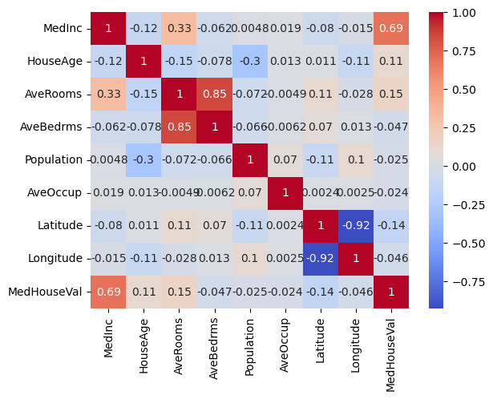
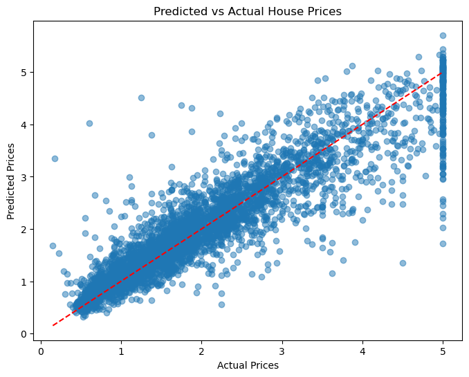

# House Price Prediction Project

This project demonstrates how to build, tune, and evaluate multiple regression models for predicting house prices using the California Housing dataset. The workflow includes data analysis, preprocessing, model comparison, hyperparameter tuning, and model saving.

---

## 📊 Workflow Overview

1. **Data Import & Analysis**
2. **Data Preprocessing**
3. **Train-Test Split**
4. **Feature Scaling**
5. **Model Training & Comparison**
6. **Hyperparameter Tuning**
7. **Model Saving & Prediction**
8. **Results Visualization**

---

## 1. Data Import & Analysis

- Load the dataset using scikit-learn.
- Explore the data using `.head()`, `.info()`, `.describe()`.
- Visualize correlations.

```python
import pandas as pd
from sklearn.datasets import fetch_california_housing

hp_df = fetch_california_housing(as_frame=True).frame
hp_df.head()
hp_df.info()
hp_df.describe()
```

**Correlation Heatmap:**
```python
import seaborn as sns
import matplotlib.pyplot as plt
sns.heatmap(hp_df.corr(), annot=True, cmap='coolwarm')
plt.show()
```
*Save this plot as `images/heatmap.png` for documentation.*

---

## 2. Data Preprocessing

- Check for missing values.
- Select features (`X`) and target (`y`).

```python
hp_df.isnull().sum()
X = hp_df.drop('MedHouseVal', axis=1)
y = hp_df['MedHouseVal']
```

---

## 3. Train-Test Split

- Split the data into training and testing sets.

```python
from sklearn.model_selection import train_test_split
X_train, X_test, y_train, y_test = train_test_split(X, y, test_size=0.2, random_state=42)
```

---

## 4. Feature Scaling

- Standardize features for better model performance.

```python
from sklearn.preprocessing import StandardScaler
scaler = StandardScaler()
X_train_scaled = scaler.fit_transform(X_train)
X_test_scaled = scaler.transform(X_test)
```

---

## 5. Model Training & Comparison

- Use pipelines to compare Linear Regression, Ridge, Lasso, Random Forest, and XGBoost.
- Use `GridSearchCV` for hyperparameter tuning.

```python
from sklearn.pipeline import Pipeline
from sklearn.linear_model import LinearRegression, Ridge, Lasso
from sklearn.ensemble import RandomForestRegressor
from xgboost import XGBRegressor
from sklearn.model_selection import GridSearchCV
from sklearn.metrics import mean_squared_error, r2_score

models_params = [
    ('LinearRegression', LinearRegression(), {}),
    ('Ridge', Ridge(), {'reg__alpha': [0.1, 1.0, 10.0]}),
    ('Lasso', Lasso(), {'reg__alpha': [0.001, 0.01, 0.1, 1.0]}),
    ('RandomForest', RandomForestRegressor(random_state=42), {'reg__n_estimators': [50, 100], 'reg__max_depth': [5, 10]}),
    ('XGBRegressor', XGBRegressor(random_state=42, verbosity=0), {'reg__n_estimators': [50, 100], 'reg__max_depth': [3, 6]})
]

results = {}

for name, model, params in models_params:
    pipe = Pipeline([
        ('scaler', StandardScaler()),
        ('reg', model)
    ])
    grid = GridSearchCV(pipe, param_grid=params, cv=5, scoring='neg_mean_squared_error', n_jobs=-1)
    grid.fit(X_train, y_train)
    y_pred = grid.predict(X_test)
    mse = mean_squared_error(y_test, y_pred)
    r2 = r2_score(y_test, y_pred)
    results[name] = {
        'Best Params': grid.best_params_,
        'Test MSE': mse,
        'Test R2': r2
    }
    print(f"{name}: Best Params={grid.best_params_}, Test MSE={mse:.4f}, Test R2={r2:.4f}")
```

---

## 6. Results Visualization

- Compare model performance.

```python
import pandas as pd
results_df = pd.DataFrame(results).T
print(results_df)
```

**Example Table:**

| Model           | Best Params                  | Test MSE | Test R2 |
|-----------------|-----------------------------|----------|---------|
| LinearRegression| {}                          | 0.52     | 0.61    |
| Ridge           | {'reg__alpha': 1.0}         | 0.51     | 0.62    |
| ...             | ...                         | ...      | ...     |

---

## 7. Model Saving & Prediction

- Save the best model and use it for predictions.

```python
import joblib

best_model_name = max(results, key=lambda k: results[k]['Test R2'])
for name, model, params in models_params:
    if name == best_model_name:
        best_pipe = Pipeline([
            ('scaler', StandardScaler()),
            ('reg', model)
        ])
        grid = GridSearchCV(best_pipe, param_grid=params, cv=5, scoring='neg_mean_squared_error', n_jobs=-1)
        grid.fit(X_train, y_train)
        joblib.dump(grid.best_estimator_, 'best_house_price_model.pkl')
        print("Best model saved as 'best_house_price_model.pkl'")
        y_pred = grid.predict(X_test)
        print(f"Test R2: {r2_score(y_test, y_pred):.4f}")
        print(f"Test MSE: {mean_squared_error(y_test, y_pred):.4f}")
        break
```

---

## 8. Example Visualizations

**Feature Correlation Heatmap:**


**Predicted vs Actual Plot:**
```python
plt.figure(figsize=(8,6))
plt.scatter(y_test, y_pred, alpha=0.5)
plt.xlabel("Actual Prices")
plt.ylabel("Predicted Prices")
plt.title("Predicted vs Actual House Prices")
plt.plot([y_test.min(), y_test.max()], [y_test.min(), y_test.max()], 'r--')
plt.show()
```


---

## 📁 Project Structure

```
HousePricePredictionXGBooster/
│
├── Notebook/
│   └── index.ipynb
├── images/
│   ├── heatmap.png
│   └── pred_vs_actual.png
├── best_house_price_model.pkl
├── README.md
└── ...
```

---

## 🚀 Conclusion

- Multiple regression models were compared for house price prediction.
- The best model was selected using cross-validation and hyperparameter tuning.
- The final model was saved and can be used to predict house prices on new data.
- This workflow can be adapted to other regression problems with similar structure.
