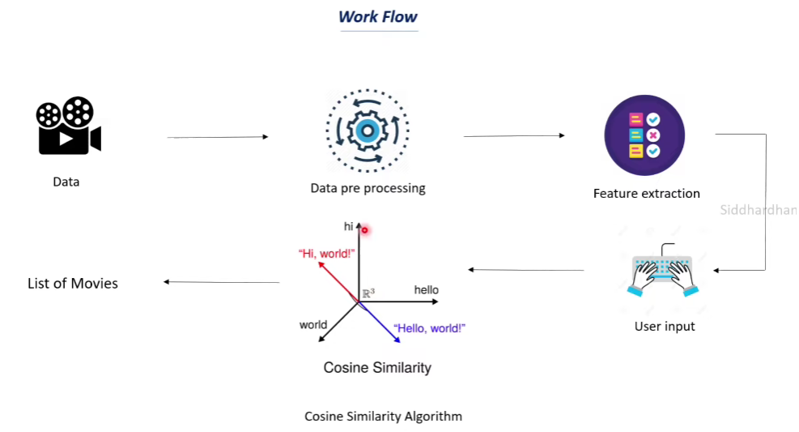

# Movies Recommendation System 🎬

This project demonstrates a content-based movies recommendation system using Python and scikit-learn. The system recommends movies based on the similarity of their content features such as keywords, cast, genres, director, tagline, overview, and title.

---

## 📊 Workflow Overview

1. **Data Loading & Cleaning**
2. **Feature Selection & Preprocessing**
3. **Feature Extraction (TF-IDF)**
4. **Similarity Calculation (Cosine Similarity)**
5. **Recommendation Generation**
6. **Visualization of Workflow**

---

## 1. Data Loading & Cleaning

```python
import pandas as pd

movies = pd.read_csv('../Datasets/movies.csv')
movies.drop(columns=['index'], inplace=True)
movies.drop(columns=['homepage'], inplace=True)  # homepage column mostly null
```

---

## 2. Feature Selection & Preprocessing

```python
features = ['keywords', 'cast', 'genres', 'director', 'tagline', 'overview', 'title']
for feature in features:
    movies[feature] = movies[feature].fillna('')
```

---

## 3. Feature Extraction (TF-IDF)

```python
from sklearn.feature_extraction.text import TfidfVectorizer

def combine_features(features_list):
    temp_df = movies[features_list].copy()
    return temp_df.apply(lambda row: ' '.join(row), axis=1)

combined_features = combine_features(features_list=features)
tfidf_vectorizer = TfidfVectorizer()
tfidf_matrix = tfidf_vectorizer.fit_transform(combined_features)
```

---

## 4. Similarity Calculation (Cosine Similarity)

```python
from sklearn.metrics.pairwise import cosine_similarity

cosine_sim = cosine_similarity(tfidf_matrix)
```

---

## 5. Recommendation Generation

```python
import difflib

movies_name = "God father"
movies_list = movies['title'].tolist()
close_match = difflib.get_close_matches(movies_name, movies_list)
movie_index = movies[movies.title == close_match[0]].index[0]

similarity_score = list(enumerate(cosine_sim[movie_index]))
sorted_similar_movies = sorted(similarity_score, key=lambda x: x[1], reverse=True)

recommended_movies = sorted_similar_movies[0:5]
print("Movies recommended for you:")
for movie in recommended_movies:
    print(movies.iloc[movie[0]].title)
```

---

## 6. Visualization of Workflow



---

## 📁 Project Structure

```
MoviesRecommendationSystem/
│
├── Notebooks/
│   └── index.ipynb
├── images/
│   └── workflow.png
├── Datasets/
│   └── movies.csv
└── README.md
```

---

## 📝 Insights

- **Content-Based Filtering:** Recommends movies based on the similarity of their content features.
- **Text Feature Engineering:** Uses TF-IDF vectorization to convert text data into numerical features.
- **Cosine Similarity:** Measures similarity between movies for recommendation.
- **Flexible:** Can be extended to include more features or hybrid approaches.
